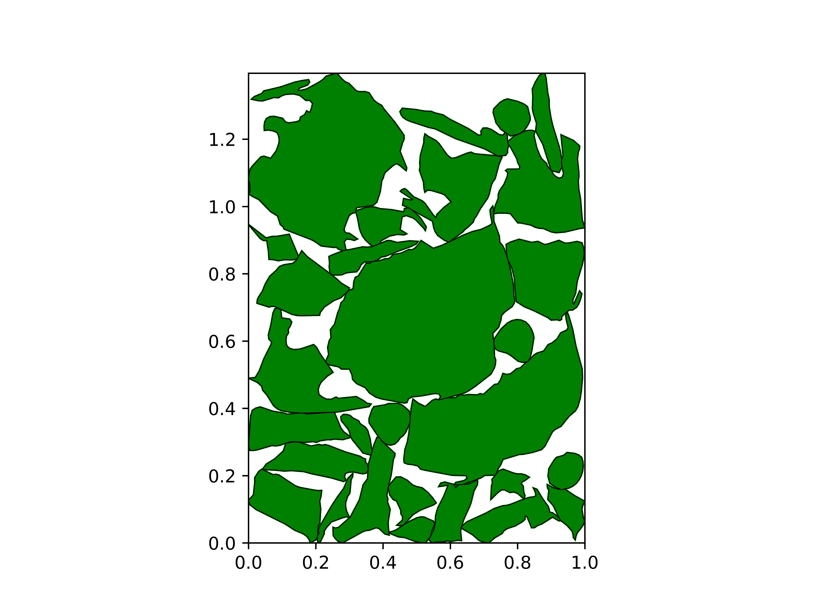

# 2D Packing vai Reinforcement Learning

## The packing result:

## The first result: encoding the state and action through the index, Index represents the shape, and use greedy, Q-learning and DQN as reinforcement learning framework.

## The second result: encoding the stae and action throught resnet18 that extracts feature data from images，and use MLP as reinforcement learning framework.

## The geometry ways include the no-fit polygon(NFP) and bottom-left fill(BLF)

## NFP: orbit way(incomplete implementation) and minkowski way(complete)
